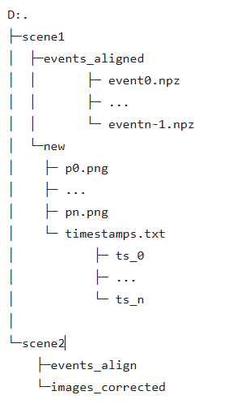
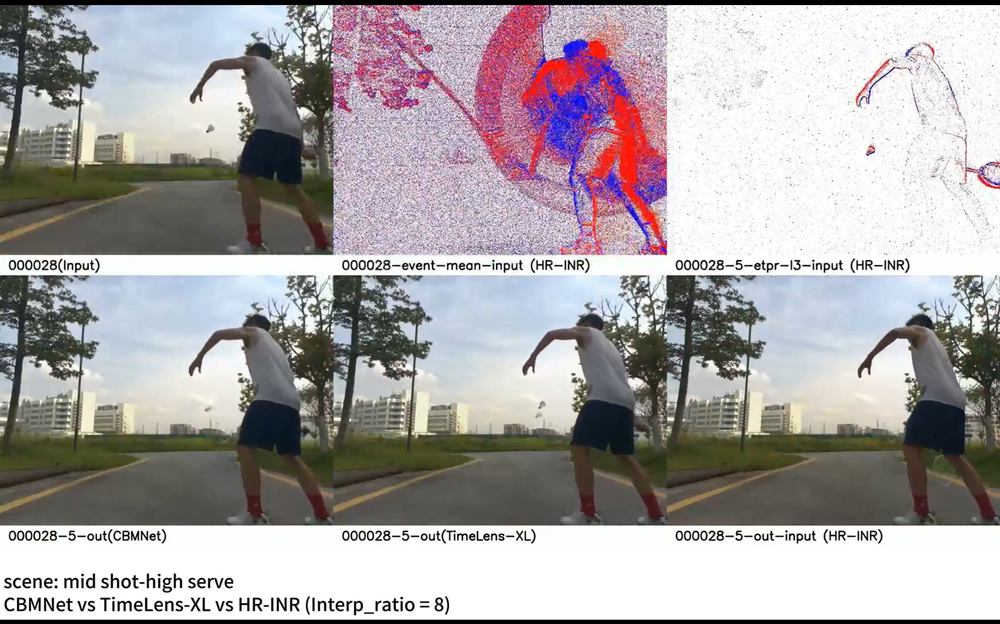
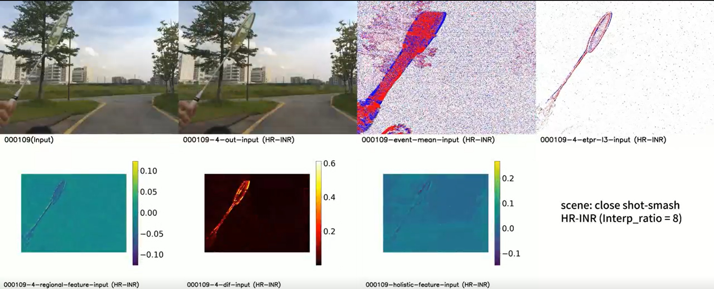

# High-Speed Motion Analysis in Badminton via Event Camera
This is a readme of the xprogram project "High-Speed Motion Analysis in Badminton via Event Camera", we mainly adopt the HR-INR, Timelens-XL and CBMNet model to our dataset and compare their performance on our dataset. You may see the code and visual result in the later part.

## Methods Used
We have reimplemented three state-of-the-art models for comparison:  

**-HR-INR (High-Resolution Implicit Neural Representation)**  
**-CBMNet**  
**-Timelens-XL**  

The complete implementation code for each model is available in the repository, along with configuration files and training scripts.art.

## Datasets Used

### Data Collection
We constructed a dedicated badminton motion dataset using equipment from the AI Lab, specifically utilizing the APX EVB Gen2 event camera. The dataset includes:  

**-Multiple camera positions (close-up, mid-shot, long-shot)**  
**-Various shooting angles covering typical badminton court scenarios**  
**-Comprehensive motion patterns including fast shuttlecock trajectories and player movements.**  

*Detailed specifications of the data collection process are documented in "羽毛球事件相机运动去模糊数据集拍摄脚本.docx".*

### Data Format
The raw output from the APX EVB Gen2 camera is in binary format, which requires preprocessing for model compatibility. We converted the binary data into PNG (for intensity frames) and NPZ (for event data) formats, which are compatible with all three models evaluated in this work.

The required directory structure is as follows

*Note: The timestamps.txt file must contain corresponding timestamps for each PNG frame*

### Event Data Preprocessing
To handle the raw binary output from the event camera, we provide event_preprocessing_v2.ipynb - a Jupyter notebook that:  

**-Reads raw image data and timestamp information**  
**-Converts binary event data into array format**  
**-Performs necessary normalization and alignment**  
**-Generates compatible input files for all evaluated models**  

## Pretrained Model
The pretrained model of HR-INR corresponds to the parameter setting : epr_encoder_name: swin

Those model can be found in [link]()

## Result
We found out the performance of TimelensXL, CBMNet is not that qualified and have the serious problem of discontinuity which may result from the assumption of linear motion. These two model adopt the optical flow to estimate the motion and suffer from those highly dynamic scenarios or non-linear motion scenarios. 

This situation is much more relieved in the output of HR-INR. Its motion prediction logic leverages the high temporal resolution of event cameras, hierarchical temporal representation, and implicit neural embedding, completely abandoning the traditional optical flow-based "displacement vector calculation" paradigm.

We have adopted those model on 4 different angles or shooting distance.
## Intermediate visualization
For deeper insight into HR-INR's performance, we provide intermediate output visualizations:

These visualizations illustrate the model's internal processing of motion information, including regional and holistic feature representations.

## Video Supplementary Materials
For a better understanding of our method and its performance, we provide visualizations of the results on various datasets. The following figures demonstrate the output of different approach, and provides the visualizable regional-features graph, holistic-feature graph, etc. For the videos, you can check this [link](https://hkustgz-my.sharepoint.com/:f:/g/personal/hqiang669_connect_hkust-gz_edu_cn/Evc6sNnP3CZJhSBra2MQRvcBWi-LfGeAANHdEVlavnVJUg?e=kld4pS).
